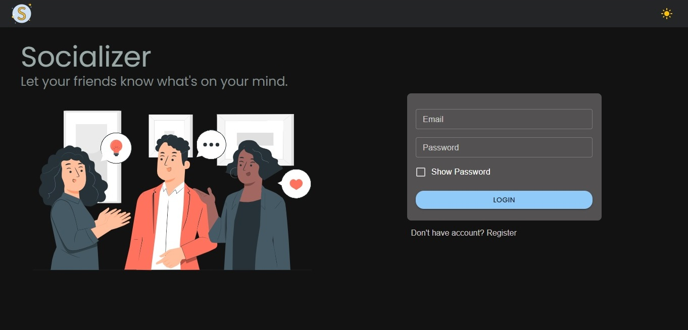
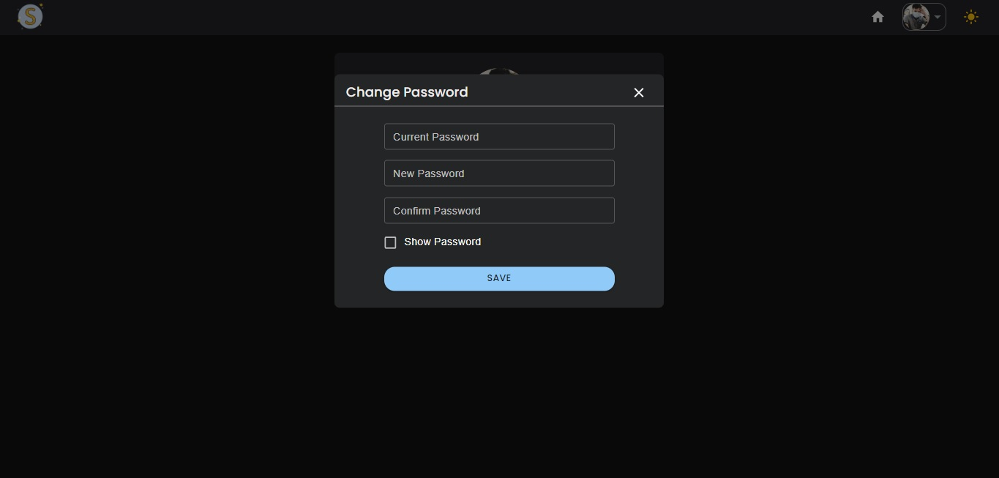

# Socializer

### Socializer is a website application that allows user to post anything what's on their mind and comment to other post.

## ⚒️ Built with the following technologies:

- ReactJS
- Typescript
- ViteJS
- ExpressJS
- MongoDB
- Redux   

## ✨ Features

- The user can login and register
- The user can post and comment to the other post
- The owner of the post can delete his/her post and also the comment within it.
- The owner of the comment can delete his/her post
- The user can change his/her own profile picture
- The user can change his/her current password
    

## 🖼️ Preview

### Login

### Register

### Home

### Profile

### Change Password

### Not Found Page

